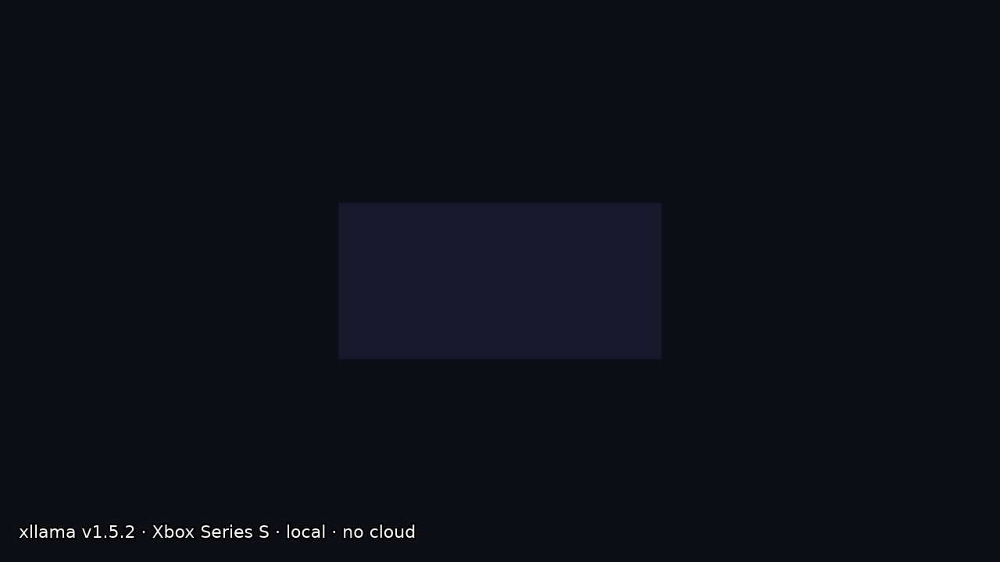

# xllama

> Local LLM + diffusion + on-device training on Xbox Series S|X — dual-backend dispatch,
> OpenAI-compat LAN endpoint, single-session invariant.
> Architecture showcase under real constraints (UWP, console, 10 GB RAM).

[](https://github.com/gianlucamazza/xllama/actions/workflows/build-uwp.yml)
[](https://github.com/gianlucamazza/xllama/actions/workflows/build-linux.yml)
[](LICENSE)

**v1.5.5.0** · [CHANGELOG](CHANGELOG.md) · [ROADMAP](ROADMAP.md)



Recorded on a Series S in Dev Mode and **played back in real time** — the decode
rate in the footer is the console's own, and nothing here is sped up. Full-quality
video: [xllama-demo-v1.5.2.mp4](https://github.com/gianlucamazza/xllama/releases/download/v1.5.2.0/xllama-demo-v1.5.2.mp4).
The demo is data, not a recording someone made by hand: the script is
[`demo/demo-script.json`](demo/demo-script.json) and `scripts/capture-demo-video.sh`
regenerates both files from it.

---

## LAN Endpoint — OpenAI-compatible

xllama exposes an HTTP endpoint on the local network that exposes its full
inference core (`SessionHub`) with OpenAI and Ollama-compatible APIs.

**Status:** v1, opt-in, default OFF. Dev Mode / LAN research only.

```bash
# Chat completions (non-streaming)
curl -s http://<xbox-ip>:11434/v1/chat/completions \
  -H 'Content-Type: application/json' \
  -d '{"model":"lfm25-350m","messages":[{"role":"user","content":"hi"}]}'

# Model discovery (OpenAI shape)
curl -s http://<xbox-ip>:11434/v1/models

# Model discovery (Ollama shape)
curl -s http://<xbox-ip>:11434/api/tags

# Preferences → training samples
curl -s http://<xbox-ip>:11434/v1/preferences \
  -d '{"label":"like","messages":[...]}'

# Training status
curl -s http://<xbox-ip>:11434/v1/training/status

# Image generation (SD-Turbo)
curl -s http://<xbox-ip>:11434/v1/images/generations \
  -d '{"prompt":"pixel art robot","steps":2,"seed":42}'
```

### Protocol

| Route                         | Shape      | Note                                    |
| ----------------------------- | ---------- | --------------------------------------- |
| `POST /v1/chat/completions`   | OpenAI     | Non-streaming, single-slot mutex        |
| `GET /v1/models`              | OpenAI     | `"active": true` on the loaded model    |
| `GET /api/tags`               | Ollama     | Same list, Ollama shape                 |
| `POST /v1/preferences`        | Custom     | Append JSONL → `training/samples.jsonl` |
| `GET /v1/training/status`     | Custom     | Snapshot of on-device train progress    |
| `POST /v1/images/generations` | OpenAI-ish | SD-Turbo, `b64_json` + `path`           |
| `GET /health`                 | Custom     | `{"status":"ok","service":"xllama"}`    |

### Requirements

- **Model:** `"model"` field in request, fallback to `model.txt`. Swaps the
  resident Session if different from the loaded one.
- **Context budget:** `fit_prompt` with exact tokenizer, not chars/token.
  Drops oldest messages, never the trailing user. 400 if the user message
  alone exceeds `n_ctx`.
- **Concurrency:** single-slot. `try_lock` → 503 busy. Pre-load wait ≤15s.
- **Streaming:** not implemented (seam: `GenerateParams::on_token`).
- **CORS:** OPTIONS preflight supported for browser clients.
- **Foreground only:** UWP PLM — the app must be in the foreground.

### Enable

Settings → LAN API: port (default 11434), toggle on/off.
Persistence: `LocalState\api.flag` + `api-port.txt`.

---

## Architecture at a glance

### Two pillars, one core

| Pillar        | Role                       | Hot path                    |
| ------------- | -------------------------- | --------------------------- |
| **Inference** | Chat, diffusion, LAN API   | `Session` / `run_inference` |
| **Training**  | PEFT adapters, merged GGUF | `TrainingJob` → artefacts   |

Core: `src/bridge/` C++17, WinRT-free headers in `include/xllama/`, host-testable.
Two front-ends: `xllama-cli` (Linux) + UWP app.

### Backend dispatch

| Path                     | What                                            | Why                                      |
| ------------------------ | ----------------------------------------------- | ---------------------------------------- |
| **ORT GenAI + DirectML** | ONNX models, CPU int4 decode + DML fp16 prefill | GPU wins batch compute, long-prompt TTFT |
| **llama.cpp + GGUF**     | CPU-only, KV-reuse, repacked GEMM               | Zen2 wins autoregressive decode          |

Unified build dispatches **per model at runtime** via `Backend::Auto`.
Llama.cpp is both benchmarking lane and shipping backend.

### Key invariants

- **One resident session** (`SessionHub`) — never 2× model in RAM
- **One budget enforcement point** (`fit_prompt`) — tokens, not chars
- **One sampler chain per backend** — CLI/bench and GUI/API can't diverge
- **Single-home rule** — a decision both surfaces make lives in one header

### Platform constraints

- UWP/AppContainer: no mmap, no dlopen, no registry, no arbitrary paths
- Xbox Series S: 10 GB unified memory, 3801 MB GPU budget (Game), ~2.2 GB free disk
- Patched ORT/GenAI DLLs while upstream lacks AppContainer fixes
- Dev Mode only — no retail path yet

---

## What you can do

- **Chat** — multi-turn with KV-reuse, thinking models, coding tier
- **Diffuse** — SD-Turbo on DirectML, in-process with XAML compositor
- **Train** — on-device partial FT (Lane B), host PEFT (Lane A), serve merged GGUF (Lane C)
- **LAN API** — OpenAI-compat `POST /v1/chat/completions`, preferences, training status
- **Bench** — headless tok/s, membw, diskbw, gpubw, gpugemv, ramceil probes

---

## Supported models

| Model | Params | Decode | Role |
| ----- | ------ | ------ | ---- |
| LFM2.5-230M | 230M | **119.2** tok/s | Floor (fastest, 241 MB) |
| LFM2.5-350M | 350M | **94.9** tok/s | Default chat |
| LFM2-2.6B | 2.6B | **18.4** tok/s | Quality (H9 7/8) |

Full catalogue + Phase 14 coding models: [model-matrix.md](docs/model-matrix.md) · [benchmarks.md](docs/benchmarks.md)

---

## Repository map

```
include/xllama/   # 32 headers, WinRT-free, host-testable
src/bridge/       # shared implementation (Linux + UWP)
uwp/              # C++/WinRT app, LAN API, headless flags
training/         # jobs, host PEFT, datasets
shaders/          # HLSL → AOT DXIL compute shaders
tests/            # 29 test files, 243 cases / 4346 assertions
scripts/          # deploy, bench, validate, crossbuild
docs/             # SSOT map → docs/README.md
```

**Full layout:** [AGENTS.md](AGENTS.md) · **Doc ownership:** [docs/README.md](docs/README.md)

---

## Key design decisions

### Why Xbox Series S?

Zen2 CPU wins decode at this scale. RDNA2 GPU wins batch prefill.
Unified memory means the GPU budget (3801 MB Game) is the hard constraint.
Underexplored platform — no prior LLM runtime for Series S|X.

### Why dual backend?

Per-workload verdict: CPU decode > GPU decode. GPU prefill > CPU prefill.
One backend can't win both. Runtime dispatch per model is the answer.

### Why single Session owner?

CPU ~1.3 GB + DML ~2.9 GB don't coexist in budget. Two models = OOM.
`SessionHub` makes this a process-wide invariant, not a per-surface convention.

### Why token-budget, not chars-per-token?

Measured: prose 4.6 chars/token, dense C++ 2.5. A constant trades truncated
answers for history that would have fit. The estimate survives only for routing,
where being wrong costs a decision, not an answer.

### Why consolidate duplicated loops?

Every copy in this codebase has eventually disagreed — silently.
`decode_loop.h` (llama), `decode_loop_ort.h` (ORT), `sampler_chain.h` (llama),
`ort_sampling.h` (ORT) — each decision lives in one header.

---

## Quick install

```bash
# Pre-built MSIX from CI release
./scripts/install-latest-build.sh

# Or build (Windows host)
git clone --recursive https://github.com/gianlucamazza/xllama.git
.\scripts\build-uwp.ps1 -Configuration Release -Platform x64

# Deploy
source ~/.config/xllama/xbox-env
./scripts/deploy.sh path/to/xllama_*.msix
```

First launch: downloads default model (~229 MB). No model bundled in MSIX.

**Linux dev:** `cmake --preset linux-release && cmake --build build/linux-release -j`

---

## More docs

| Topic                                              | Docs                                                                |
| -------------------------------------------------- | ------------------------------------------------------------------- |
| Full architecture (modules, backends, KV, routing) | [architecture.md](docs/architecture.md)                             |
| Training pillar (lanes A/B/C, Phase 11 UI arc)     | [training-architecture.md](docs/training-architecture.md)           |
| AppContainer constraints (§1–§13)                  | [uwp-constraints.md](docs/uwp-constraints.md)                       |
| Model catalogue + selection                        | [model-selection.md](docs/model-selection.md)                       |
| Performance numbers                                | [benchmarks.md](docs/benchmarks.md)                                 |
| App usage guide                                    | [using-the-app.md](docs/using-the-app.md)                           |
| LAN API protocol (detailed)                        | [api-endpoint.md](docs/api-endpoint.md)                             |
| Console validation gates                           | [console-validation-runbook.md](docs/console-validation-runbook.md) |
| Crossbuild Linux → Xbox                            | [crossbuild-console.md](docs/crossbuild-console.md)                 |
| Store readiness                                    | [store-readiness.md](docs/store-readiness.md)                       |
| Technical report (frozen v1.0)                     | [technical-report.md](docs/technical-report.md)                     |

---

## Contributing

Areas of interest:

- UWP packaging, Xbox Dev Mode quirks
- Compact ONNX models fitting disk/GPU budgets
- Benchmark methodology and reproducibility
- Non-Windows developer documentation

See [CONTRIBUTING.md](CONTRIBUTING.md).

---

## Acknowledgements

- [`llama.cpp`](https://github.com/ggml-org/llama.cpp) — Georgi Gerganov
- [ONNX Runtime GenAI](https://github.com/microsoft/onnxruntime-genai) — Microsoft
- Xbox homebrew community
- Andrei David's `llama2.c` port to Xbox 360

## License

MIT. `llama.cpp` submodule under MIT.
