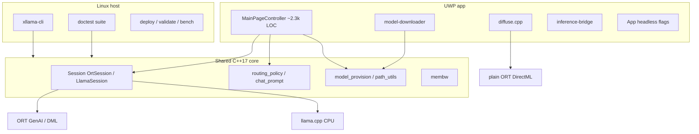

# Project analysis — xllama (2026-07-15)

> **Project health snapshot**, not a performance SSOT. Numbers below are
> headlines only; authoritative tables live in [benchmarks.md](benchmarks.md).
> System structure: [architecture.md](architecture.md). Constraints:
> [uwp-constraints.md](uwp-constraints.md). Version/open items:
> [CHANGELOG.md](../CHANGELOG.md) + [ROADMAP.md](../ROADMAP.md).

**Scope:** evidence-first audit of shipping state, architecture, quality, ops,
docs currency, risks, and Phase 6 priorities. **No console re-bench** — claims
cross-checked against CSVs and docs already on main. Host tests re-run
2026-07-15.

---

## 1. Executive summary

xllama is a **shipping research-grade** UWP app (semantic version **1.1.7.0**,
Revision CI-stamped) that runs local LLM chat and SD-Turbo image generation on
Xbox Series S|X Dev Mode. The measured hardware story is stable and well
documented: **CPU wins decode**, **GPU wins prefill-at-scale and diffusion**,
with per-conversation routing and dual text backends (ORT GenAI + llama.cpp) in
one **unified** MSIX (~19 MB, no model).

Phases **1–5 are complete**. Phase **6** is mostly done on engineering
(Gemma, GGUF KV-reuse, quant auto-upgrade, membw, 1.7B catalogue, external-data
ORT patch **console-validated**). Remaining product work is:

1. ~~**Promote** the patched ORT DLL into default shipping~~ **done in 1.1.8.0**
   (optional: catalogue entry for a public >2 GB external-data int4 model).
2. **Demo video** (checklist in ROADMAP); ~~publication venue~~ → GitHub Discussions.
3. ~~**docs SSOT drift** (default model)~~ **done** — unified defaults to `lfm25-350m`.

Host unit tests: **80 cases, green** (`ctest` 2026-07-15). Console gates last
reported **ALL PASS** 2026-07-14 (`validate-console.sh all`).

**Top recommendation:** treat ORT extdata promotion as P0 eng work; close demo
+ publication as P1 content; fix default-model docs drift as a cheap P1 doc PR;
leave MainPage split and DirectML fused int4 out of the critical path.

---

## 2. Status matrix

| Capability | State | Evidence |
| --- | --- | --- |
| Unified MSIX (ORT + llama.cpp) | **Shipped** | `build-uwp.yml` matrix `unified` → `xllama-appx` |
| Patched GenAI #2280 (routing GPU in XAML) | **Shipped** | `vendor-genai-dml-patch.ps1` in default CI; console 2026-07-14 |
| llamacpp-only MSIX | **Lane (bench)** | `xllama-appx-llamacpp` — not end-user |
| Patched ORT extdata (`weakly_canonical` + 16 MB ReadFile) | **Shipped (1.1.8.0)** | `build-uwp.yml` + `vendor-dlls-v1` pin; `phase6-fp16-extdata.csv` |
| Catalogue `models-v1` (360M CPU/DML, 1.7B, GGUF, SD-Turbo) | **Shipped** | `uwp/models/manifest.json` + release assets |
| Per-workload routing (600-tok Auto) | **Shipped + console** | `routing_policy.h`; runbook §2 |
| KV-reuse ORT / GGUF | **Shipped + console** | 4.87× / 4.07× (`phase35-kv`, `phase6-gemma-kv`) |
| Quant auto-upgrade provisioning | **Shipped + console** | PR #64; `model_provision.h` |
| In-process diffusion + TAESD | **Shipped + console** | runbook §7b/§7c |
| Membw micro-bench | **Shipped + console** | 12.35 GB/s @1t read |
| 1B fp16 DML inference | **Closed negative** | load OK, OOM inference (§7 budget wall) |
| DML int4 decode competitive | **Closed negative** | §12 non-fused GEMM; 8.8 tok/s |
| Demo video | **Open** | ROADMAP Phase 4/6 |
| Publication venue | **Open** | GitHub Discussions vs arXiv |
| Promote ORT patch to default ship | **Done (1.1.8.0)** | `vendor-dlls-v1` + SHA256SUMS |
| Upstream fused low-bit DML GEMM | **Deprioritised** | not a local lever |

Semantic version in tree: `uwp/AppxManifest.xml` → **1.1.7.0** (Revision `.0`
locally; CI stamps `github.run_number`).

---

## 3. Architecture health

### 3.1 Layout



Two targets, one core ([architecture.md](architecture.md)):

| Layer | Path | Role |
| --- | --- | --- |
| Core | `include/xllama/*`, `src/bridge/*` | WinRT-free; host-testable policies |
| Linux | `src/main.cpp`, `tests/` | CLI + CI unit tests |
| UWP | `uwp/*` | UI, download, diffuse, headless modes |

**Runtime dispatch:** `Backend::Auto` → `model_uses_llama_backend()` (`.gguf` /
layout) → `LlamaSession` or `OrtSession`. Shipping build links **both**.

**Headless modes** (`uwp/App.cpp`): `bench.flag`, `diffuse.flag`, `membw.flag`;
UI path also runs **autopilot** (`autopilot.flag` + `autopilot.json` in
`MainPage.cpp`).

### 3.2 Module sizes (project code)

| Area | Approx LOC | Notes |
| --- | --- | --- |
| `uwp/MainPage.cpp` | **2323** | Dominant hotspot: UI + settings + routing glue + autopilot |
| `src/bridge/*` | ~1990 | Session, inference, chat_prompt, path_utils |
| `include/xllama/*` | ~1490 | Headers; pure policy headers are small and clean |
| `uwp/` other (diffuse, downloader, chat-history, App, bridge) | ~2.3k | Reasonable splits |
| `tests/` | ~1140 | 80 TEST_CASE |
| `scripts/` | ~3500 | Deploy/bench/package — operational surface |

### 3.3 Health assessment

| Aspect | Verdict |
| --- | --- |
| Core / UI boundary | **Good** — pure policies extracted (`routing_policy`, `model_provision`, `manifest_merge`, `chat_prompt`) |
| Dual backend | **Sound** — unified dispatch measured; GGUF ships as real backend not just A/B |
| MainPage size | **Acceptable for research-grade**; costly if UI feature velocity rises |
| Diffusion isolation | **Good** — sequential ORT sessions, header-only math unit-tested |
| WinRT leakage into core | **Low** — intentional design |

**No cyclic architecture smell** at the module level; the main debt is **UI
concentration**, not wrong abstractions.

---

## 4. Performance truth table (headlines)

Cross-check 2026-07-15: [benchmarks.md](benchmarks.md) rows match key CSVs.

| Workload | Result | CSV |
| --- | --- | --- |
| Fastest chat decode | LFM2.5-350M **94.2** tok/s (t6) | `phase5-gguf` |
| ORT CPU 360M decode | **66–71** tok/s (run variance; SSOT table) | `phase1-cpu` / `phase2-dml` |
| DML fp16 360M prefill @~1k | **~354** tok/s | `phase2-dml` |
| DML int4 decode | **8.8** tok/s | `phase2-dml` |
| llama.cpp 360M Q4_K_M @t6 | **62.9** tok/s (parity, not 2×) | `phase35-llamacpp-scaling` |
| KV-reuse ORT turn-2 | **4.87×** | `phase35-kv` |
| KV-reuse GGUF (gemma3) | **4.07×** | `phase6-gemma-kv` |
| SmolLM2-1.7B CPU int4 | **20.6** tok/s, 2423 MB | `phase35-1b-cpu` |
| Gemma-3-270M | **76.8** tok/s | `phase6-gemma` |
| Gemma-4-E2B Q3_K_S | **15.3** tok/s, 2742 MB | `phase6-gemma` |
| SD-Turbo 512² | **~6.9 s** total | `phase5-diffuse` |
| Membw read @1t | **12.35** GB/s | console note in benchmarks |
| Extdata int4 load (patched ORT) | loads + generates | `phase6-fp16-extdata` |

### Falsified hypotheses (research asset — do not reopen without new evidence)

1. GPU should win decode at 360M → **no** (dispatch + bandwidth).
2. DML int4 collapse = missing kernel → **no** (non-fused MatMulNBits, §12).
3. llama.cpp extracts ~2× ORT bandwidth → **no** (parity).
4. AppContainer mmap speeds GGUF load → **no** (repack-bound).
5. USB alone fixes external-data load → **no** (copy to LocalState).
6. Extdata unblock enables 1B fp16 GPU → **no** (budget wall at inference).

**Shipping vs lane numbers:** extdata path numbers apply only to the patched-ORT
lane until promotion. All other rows above are shipping-relevant.

**Re-bench needed?** No for this audit. Spot-check only if shipping ORT patch
promotion changes default DLL behaviour for existing merged models (should be
behaviour-preserving).

---

## 5. Quality & coverage matrix

### 5.1 Host tests (2026-07-15)

```
ctest --test-dir build/linux-test → 100% passed (1 test binary, 0.30 s)
```

| File | Cases | Area |
| --- | --- | --- |
| `test_chat_prompt.cpp` | 15 | ChatFormat / render / stop |
| `test_model_provision.cpp` | 13 | quant auto-upgrade predicates |
| `test_routing_policy.cpp` | 9 | routing + capability gates |
| `test_chat_history.cpp` | 8 | UWP-adjacent history logic (host) |
| `test_manifest_merge.cpp` | 7 | catalogue override |
| `test_bench.cpp` | 5 | CSV writer |
| `test_diffusion.cpp` | 5 | CLIP / Euler / golden vectors |
| `test_cli.cpp` | 4 | CLI parse |
| `test_session.cpp` | 4 | session API (light) |
| `test_utf8.cpp` | 4 | encoding |
| `test_membw.cpp` | 4 | STREAM probe |
| `test_path.cpp` | 2 | path helpers |
| **Total** | **80** | |

### 5.2 Coverage by subsystem

| Area | Host unit | Console gate | Gap? |
| --- | --- | --- | --- |
| routing_policy | yes | `validate-console.sh routing` | — |
| chat_prompt / ChatFormat | yes | implicit in Gemma benches | — |
| model_provision / quant upgrade | yes | console PR #64 | — |
| manifest_merge | yes | — | — |
| membw | yes | membw.flag | — |
| diffusion math | yes (golden) | diffuse / TAESD | — |
| path_utils | partial | provisioning path | low |
| Session Ort/Llama | light | bench scripts | acceptable |
| MainPage UI / gamepad | **no** | autopilot | **by design** |
| model-downloader HTTP | **no** | in-app download verified | residual |
| inference-bridge headless | **no** | bench / diffuse flags | residual |

### 5.3 Dependencies (pins)

| Pin | Version | Source |
| --- | --- | --- |
| ORT GenAI DirectML | 0.14.1 | `uwp/packages.config` |
| ONNX Runtime DirectML | 1.24.4 | same |
| DirectML | 1.15.4 | same |
| llama.cpp submodule | `657e011` (gguf-v0.19.0-955) | `.gitmodules` / `git submodule status` |
| Open Dependabot | PR #69 llama.cpp bump; PR #70 setup-python | review before merge |

**Assessment:** host pure-logic coverage is **strong for a hobby research app**.
Gaps are correctly placed on WinRT/HTTP/UI surfaces covered by console
autopilot and measured runbooks rather than fake unit tests.

---

## 6. Constraints & vendor patches

### 6.1 Constraint register (summary)

| § | Constraint | Mitigation | Residual |
| --- | --- | --- | --- |
| 1 | No POSIX mmap | heap / ORT internal I/O; mmap trial reverted | repack-bound load |
| 2 | AppContainer FS | LocalState + catalogue + USB | path quirks |
| 3 | No dlopen | app-local NuGet DLLs | silent MSIX omit = crash |
| 5/7 | GPU budget 3801 MB | sequential diffuse; routing model size | ≥1B fp16 OOM |
| 7 | GenAI + XAML `887A0036` | PatchedGenAI #2280 in shipping | upstream NuGet TBD |
| 8 | `weakly_canonical` / 2 GB ONNX | merge for ship; ORT patch for extdata | patch **not default ship** |
| 8 | ReadFile errcode 1450 | 16 MB chunk in same patch | same |
| — | ~6 usable cores | llama thread cap 6 | t7/t8 livelock |
| 12 | DML int4 non-fused | none local | GPU int4 decode dead |

### 6.2 Patch inventory

| Patch | Target | Shipping? |
| --- | --- | --- |
| `0001-uwp-appcontainer-guards.patch` | llama.cpp submodule | yes (unified + llamacpp CI) |
| `onnxruntime-genai-2280-dml-fallback.patch` | GenAI 0.14.1 | **yes** (default CI) |
| `onnxruntime-extdata-appcontainer.patch` | ORT 1.24.4 core | **no** — dispatch lane only |

`vendor/onnxruntime-genai-patched/` holds build output path (CI rebuilds).
`vendor/onnxruntime-patched/` documents DLL path; binary **gitignored**.

**Bit-rot risk:** high on NuGet/submodule bumps. Mitigations already exist:
`apply-uwp-patches.sh`, `check-uwp-sources.sh`, vendor scripts with
context-tolerant fallback for ORT transform. Cost of full ORT DirectML rebuild:
**1–3 h** CI (`build-uwp-ort-patched` timeout 330 min).

---

## 7. Ops readiness

| Pipeline | Role | Cadence |
| --- | --- | --- |
| `build-linux.yml` | host build + tests | PR/push |
| `build-uwp.yml` | **shipping** unified+#2280 + llamacpp lane | PR/push (~13 min) |
| `build-uwp-ort-patched.yml` | extdata ORT + GenAI MSIX | **workflow_dispatch** only |
| `build-uwp-patched.yml` | GenAI patch fallback | manual |
| `codeql.yml` | static analysis | present |

### Release path

1. CI produces `xllama-appx` (~19 MB MSIX, no model).
2. Host: `install-latest-build.sh` / `deploy.sh` via Device Portal.
3. First launch: catalogue download (default CPU model).
4. Models: `models-v1` GitHub Release + HF for >2 GB GGUF (Gemma Terms).

### Catalogue completeness (`manifest.json`)

| Entry | kind | Distribution |
| --- | --- | --- |
| `smollm2-360m-cpu-int4` | ort-genai | models-v1 |
| `smollm2-360m-dml-fp16` | ort-genai | models-v1 |
| `smollm2-1.7b-cpu-int4` | ort-genai | models-v1 |
| `qwen35-0.8b` | gguf | models-v1 |
| `lfm25-350m` | gguf | models-v1 (+ license) |
| `gemma3-270m` | gguf | HF direct |
| `gemma4-e2b` | gguf | HF direct (2.45 GB Q3_K_S) |
| `sd-turbo-fp16` | diffusion | models-v1 |

TAESD is a **toggle asset** (comment in manifest; not a top-level model entry).

### Ops notes

- **Versioning:** Major.Minor.Build manual; Revision = CI run number — correct for
  in-place console updates.
- **Secrets:** `.env.example` only; certs gitignored — good.
- **Game designation:** can reset on reinstall; must re-check (runbook).
- **install-latest-build.sh:** no longer leaves `bench.flag` by default (good UX).

---

## 8. Docs drift findings

SSOT structure is **mature** (`docs/README.md` map). Residual issues:

| ID | Finding | Severity | Fix |
| --- | --- | --- | --- |
| D1 | **Default model story split:** code default `smollm2-360m-cpu-int4` (`MainPage.cpp`); `settings-modern.json` uses `lfm25-350m`; README says SmolLM2-360M default; recommended-config chat table says LFM2.5 default unified but settings table still lists `smollm2-360m-cpu-int4` | **Medium** | Pick one SSOT (code first-launch vs “modern recommended”) and align README + recommended-config |
| D2 | README Limitations § weakly_canonical mentions **merge only**; omits validated ORT patch lane | Low | One sentence + link to `fp16-extdata-runbook.md` |
| D3 | README Phase 6 open omits **promote ORT DLL** (ROADMAP has it) | Low | Sync open-item bullets |
| D4 | CHANGELOG historical “pending” strings remain in old sections | None | Historical; keep |
| D5 | `technical-report.md` is explicitly a **v1.0 snapshot** | OK | Do not re-number; link architecture/benchmarks for currency |
| D6 | recommended-config `routing: 0` default vs settings-modern `routing: 2` | Low | Same as D1 — clarify “factory” vs “modern recommended” |

No contradiction found between **benchmarks.md headlines** and the sampled CSV
rows (LFM 94.2, KV 4.87×/4.07×, diffuse 6891.6 ms, gemma 76.8/15.3, 1.7B 20.6).

---

## 9. Risk register

| ID | Risk | L | I | Evidence | Mitigation / priority |
| --- | --- | --- | --- | --- | --- |
| R1 | ORT extdata capability not user-facing | — | — | ~~lane-only~~ **mitigated 1.1.8.0** | Optional catalogue entry for a public >2 GB extdata model |
| R2 | Vendor patch bit-rot on NuGet/submodule bump | M | H | 3 patches; ORT rebuild 1–3 h | CI apply+hash checks; careful Dependabot |
| R3 | Dependabot llama.cpp bump breaks UWP guards / Gemma | M | H | open PR #69 | CI must green; manual console GGUF smoke |
| R4 | MainPage monorepo UI cost for future features | L | M | 2323 LOC | P2 only if UI work intensifies |
| R5 | False GPU decode expectations | L | M | §12 / technical-report | docs already strong; keep messaging |
| R6 | ≥1B fp16 GPU inference unreachable | L | L | measured OOM | document as closed; no more spikes |
| R7 | Demo/publication incomplete | M | M | ROADMAP open | **P1** content |
| R8 | Game designation reset invalidates benches | L | M | runbook note | checklist in validate scripts / human |
| R9 | Default-model docs confuse new users | M | L | D1 above | **P1** doc PR |
| R10 | Upstream GenAI #2280 not in official NuGet | L | M | still vendoring patch | track upstream; keep vendor script |

Likelihood/Impact: L=low, M=medium, H=high.

---

## 10. Prioritized backlog (recommended)

| Prio | Item | Type | Effort | Depends on |
| --- | --- | --- | --- | --- |
| **P0** | Promote patched ORT DLL into default `build-uwp.yml` (cached artifact pattern like GenAI) | eng | M | lane already console-validated |
| **P0/P1** | Optional: publish one >2 GB **int4** external-data catalogue model (CPU) so the patch is user-visible | eng + assets | M | P0 |
| **P1** | Demo video (model running on Xbox hardware) | content | S–M | stable UI |
| **P1** | Choose publication venue; freeze technical-report narrative | content | S | — |
| **P1** | Fix default-model docs drift (D1/D6) | docs | S | product decision: factory vs modern default |
| **P2** | Review Dependabot PRs #69 / #70 | maint | S | CI |
| **P2** | Split MainPage / extract more pure helpers | eng | L | only if UI churn |
| **P3** | Track upstream GenAI #2280 merge | external | — | Microsoft |
| **—** | Fused DML low-bit GEMM | external | — | deprioritised |

### Suggested sequencing

```
docs drift PR (S) ──┐
                    ├──► demo video (P1)
ORT promote (P0) ───┤
                    └──► publication (P1)
Dependabot review parallel (P2)
```

---

## 11. Recommendations (top 5)

1. **Promote ORT extdata patch to shipping** with the same doctrine as #2280
   (build/cache/hash-verify in CI). Without this, Phase 6's largest engineering
   win stays invisible to users.
2. **Resolve the default-model narrative** (code factory = SmolLM2-360M vs
   modern recommended = LFM2.5). Either change first-launch default on unified
   builds or document clearly that `settings-modern.json` is opt-in.
3. **Ship the product story**: demo video + pick a venue for the technical
   report — the measured science is already stronger than the packaging.
4. **Gate Dependabot llama.cpp** on CI + a minimal console GGUF smoke (LFM or
   gemma3) before merge; never auto-merge submodule bumps.
5. **Do not invest** in DML int4 decode or ≥1B fp16 GPU spikes; closed with
   evidence. Prefer catalogue/quality and publication.

---

## Appendix A — Verification commands

```bash
# Host tests
cmake --preset linux-test && cmake --build build/linux-test -j$(nproc)
ctest --test-dir build/linux-test --output-on-failure

# Console (optional; last ALL PASS 2026-07-14)
source ~/.config/xllama/xbox-env
./scripts/validate-console.sh all

# Shipping artifact
# GitHub Actions → build-uwp → xllama-appx
./scripts/install-latest-build.sh
```

## Appendix B — SSOT index

| Concern | Home |
| --- | --- |
| Structure | [architecture.md](architecture.md) |
| Performance | [benchmarks.md](benchmarks.md) |
| UWP limits | [uwp-constraints.md](uwp-constraints.md) |
| Models | [model-selection.md](model-selection.md) + `uwp/models/manifest.json` |
| Version / open work | [CHANGELOG.md](../CHANGELOG.md), [ROADMAP.md](../ROADMAP.md) |
| Narrative v1.0 | [technical-report.md](technical-report.md) |
| Console gates | [console-validation-runbook.md](console-validation-runbook.md) |
| Extdata lane | [fp16-extdata-runbook.md](fp16-extdata-runbook.md) |
| This snapshot | `docs/project-analysis-2026-07.md` |

## Appendix C — Analysis metadata

| Field | Value |
| --- | --- |
| Date | 2026-07-15 |
| Tree | `main` @ clean working tree (analysis commit pending) |
| Method | Docs + code + CSV cross-check; host ctest; no console re-run |
| Analyst | automated session following plan A–I |
