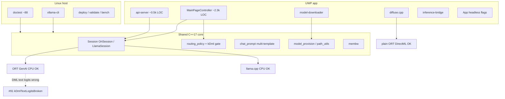

# Project analysis — xllama (2026-07-15; currency **2026-07-17**)

> **Project health snapshot**, not a performance SSOT. Numbers below are
> headlines only; authoritative tables live in [benchmarks.md](benchmarks.md).
> System structure: [architecture.md](architecture.md). Constraints:
> [uwp-constraints.md](uwp-constraints.md). Version/open items:
> [CHANGELOG.md](../CHANGELOG.md) + [ROADMAP.md](../ROADMAP.md). Vendor residual:
> [vendor-lifecycle-plan.md](vendor-lifecycle-plan.md).

**Scope:** evidence-first audit of shipping state, architecture, quality, ops,
docs currency, risks, and priorities. **No console re-bench** for this pass —
claims cross-checked against CSVs, CHANGELOG, ROADMAP, and code on `main`.
Host test inventory counted 2026-07-16; console **FULL PASS** recorded on
`1.2.0.534` (2026-07-16).

**Currency history**

| Pass | Tree focus |
| --- | --- |
| 2026-07-15 | 1.1.8 prep; PatchedOrt promote; ~80 host tests |
| 2026-07-16 AM | 1.1.8.0 shipped; docs D1–D8; dual pin on `vendor-dlls-v1` |
| **2026-07-17** | **1.2.0.0** on `main`; **#91 DML text gate**; LAN API; Phase 7 H4; ~88 tests |

This file supersedes the 2026-07-15 / 2026-07-16 AM matrices on routing and
semantic version. Historical rows below that still mention 1.1.8 as a *ship
event* remain valid; shipping *head* is 1.2.0.x.

---

## 1. Executive summary

xllama is a **shipping research-grade** UWP app (semantic version **1.2.0.0**,
Revision CI-stamped) that runs local LLM chat and SD-Turbo image generation on
Xbox Series S|X Dev Mode. The measured hardware story is stable: **CPU wins
decode**, **GPU wins diffusion** (and historically prefill-at-scale), with dual
text backends (ORT GenAI + llama.cpp) in one **unified** MSIX (~19 MB, no model).

**Correctness gate (2026-07-16):** DML **text** logits are wrong on the Series S
driver (issue [#91](https://github.com/gianlucamazza/xllama/issues/91) — GQA and
MultiHeadAttention, NMSE ~1). `kDmlTextLogitsBroken` forces CPU for all routing
modes; the 725 MB `gpu_model` is not auto-provisioned (#95/#98/#100). Diffusion
(plain ORT DML) is unaffected. Re-enable only when
`scripts/validate-logit-parity.sh` PASSes on a DML text model.

Phases **1–5 are complete**. Phase **6** engineering is done except **demo
video**. Phase **7** is open: H4 PASS (Llama-3.2-3B on catalogue); H1/H9 open.

| Dimension | Verdict |
| --- | --- |
| Maturity | Shipping research platform (not MVP) |
| Semantic version in tree | **1.2.0.0** (`uwp/AppxManifest.xml`) |
| GitHub Latest release | **v1.1.8.0** — **gap** vs `main` (publish 1.2.0 when ready) |
| Host tests | **~88** `TEST_CASE`, green (inventory 2026-07-16) |
| Console | **ALL PASS** on `1.2.0.534` (2026-07-16): routing gate, GGUF, TAESD, LAN API, no gpu_model auto-provision |
| Top product residual | Demo video (Phase 6) |
| Top eng residual | Vendor pin drop (#84/#85/#86); keep #91 gate |

**Top recommendations:** (1) keep DML text gated; (2) ship demo video; (3) tag
GitHub Release **v1.2.0.x** so Latest matches `main`; (4) Phase 7 quality (H9)
before speculative/MoE eng; (5) watch NuGet for GenAI post-#2280.

---

## 2. Status matrix

| Capability | State | Evidence |
| --- | --- | --- |
| Unified MSIX (ORT + llama.cpp) | **Shipped** | `build-uwp.yml` → `xllama-appx` |
| Patched GenAI #2280 (XAML + DML device) | **Shipped** (upstream merged; NuGet 0.14.1 still needs pin) | `vendor-dlls-v1` + GenAI `SHA256SUMS` |
| llamacpp-only MSIX | **Lane (bench)** | `xllama-appx-llamacpp` |
| Patched ORT extdata | **Shipped (1.1.8.0+)** | `vendor-dlls-v1` + ORT `SHA256SUMS` |
| Catalogue `models-v1` + HF GGUF | **Shipped** | `uwp/models/manifest.json` (9 entries incl. `llama32-3b`) |
| Default chat LFM2.5-350M | **Shipped** | ~94 tok/s; first-launch unified |
| Per-workload routing policy | **Shipped; GPU path gated OFF (#91)** | `routing_policy.h` `kDmlTextLogitsBroken` |
| KV-reuse ORT / GGUF | **Shipped + console** | 4.87× / 4.07× |
| Quant auto-upgrade | **Shipped + console** | PR #64 |
| In-process diffusion + TAESD | **Shipped + console** | runbook §7b/§7c |
| Membw micro-bench | **Shipped + console** | ~12.35 GB/s @1t read |
| LAN HTTP API (OpenAI-compatible) | **Shipped (opt-in, default OFF)** | `uwp/api-server.*`; `docs/api-endpoint.md` |
| Logit-parity harness | **Shipped** | host + on-device; gate for ORT assets |
| Llama-3.2-3B catalogue + template | **Shipped** | H4 PASS 14.2 tok/s |
| Phi-3.5-mini A/B | **Measured, no catalogue** | 11.3 tok/s / 2453 MB — loses to Llama |
| 1B fp16 DML inference | **Closed negative** | OOM §7 |
| DML int4 decode competitive | **Closed negative** | §12 |
| DML text logits correct | **Broken on device (#91)** | re-enable = parity PASS only |
| Demo video | **Open** | ROADMAP Phase 6 |
| Publication venue | **Done** | [Discussion #76](https://github.com/gianlucamazza/xllama/discussions/76) |
| GitHub Latest = semantic head | **Gap** | Latest v1.1.8.0; tree 1.2.0.0 |
| Drop PatchedGenAI / PatchedOrt | **Blocked NuGet / upstream** | #84, #85, #86 |

Semantic version in tree: `uwp/AppxManifest.xml` → **1.2.0.0** (Revision `.0`
locally; CI stamps `github.run_number`).

---

## 3. Architecture health

### 3.1 Layout



Two targets, one core ([architecture.md](architecture.md)):

| Layer | Path | Role |
| --- | --- | --- |
| Core | `include/xllama/*`, `src/bridge/*` | WinRT-free; host-testable policies |
| Linux | `src/main.cpp`, `tests/` | CLI + CI unit tests |
| UWP | `uwp/*` | UI, download, diffuse, API, headless modes |

**Runtime dispatch:** `Backend::Auto` → `model_uses_llama_backend()` →
`LlamaSession` or `OrtSession`. Shipping build links **both**. Routing may
still select a GPU model id in settings, but `decide_routing` never returns GPU
while `kDmlTextLogitsBroken` is true.

**Headless modes** (`uwp/App.cpp`): `bench.flag`, `diffuse.flag`, `membw.flag`;
UI path also runs **autopilot**. API: `api.flag` + optional `api-port.txt`.

### 3.2 Module sizes (project code, approx)

| Area | Approx LOC | Notes |
| --- | --- | --- |
| `uwp/MainPage.cpp` | **~2340** | Dominant hotspot: UI + settings + routing glue + autopilot |
| `uwp/api-server.cpp` | **~530** | LAN OpenAI-compatible endpoint (1.2.0) |
| `src/bridge/*` | ~2.0k | Session, inference, chat_prompt, path_utils |
| `include/xllama/*` | ~1.5k | Headers; pure policy headers stay small |
| `tests/` | ~1.2k+ | ~88 TEST_CASE across 13 files |
| `scripts/` | ~3.5k | Deploy/bench/package — operational surface |

### 3.3 Health assessment

| Aspect | Verdict |
| --- | --- |
| Core / UI boundary | **Good** — pure policies extracted |
| Dual backend | **Sound** — GGUF is production default (LFM), not A/B only |
| Correctness under #91 | **Good** — explicit gate, no silent GPU answers, no useless 725 MB download |
| MainPage size | **Acceptable for research-grade**; costly if UI feature velocity rises |
| Diffusion isolation | **Good** — sequential ORT sessions; not broken by #91 |
| WinRT leakage into core | **Low** | intentional design |

**No cyclic architecture smell** at module level; main structural debt is **UI
concentration**, not wrong abstractions.

---

## 4. Performance truth table (headlines)

Cross-check: [benchmarks.md](benchmarks.md) remains SSOT; CSV names unchanged.

| Workload | Result | CSV / note |
| --- | --- | --- |
| Fastest chat decode | LFM2.5-350M **94.2** tok/s (t6) | `phase5-gguf` |
| ORT CPU 360M decode | **66–71** tok/s | `phase1-cpu` / `phase2-dml` |
| DML fp16 360M prefill @~1k | **~354** tok/s (historical) | **do not route user answers here** while #91 |
| DML int4 decode | **8.8** tok/s + wrong logits (#91) | closed as product path |
| llama.cpp 360M Q4_K_M @t6 | **62.9** tok/s (parity, not 2×) | `phase35-llamacpp-scaling` |
| KV-reuse ORT turn-2 | **4.87×** | `phase35-kv` |
| KV-reuse GGUF (gemma3) | **4.07×** | `phase6-gemma-kv` |
| SmolLM2-1.7B CPU int4 | **20.6** tok/s, 2423 MB | `phase35-1b-cpu` |
| Gemma-3-270M | **76.8** tok/s | `phase6-gemma` |
| Gemma-4-E2B Q3_K_S | **15.3** tok/s, 2742 MB | `phase6-gemma` |
| Llama-3.2-3B Q3_K_S | **14.2** tok/s, 1824 MB | `phase7-scale` |
| Phi-3.5-mini Q3_K_S | **11.3** tok/s, 2453 MB | `phase7-scale` — no catalogue |
| SD-Turbo 512² | **~6.9 s** total | `phase5-diffuse` |
| Membw read @1t | **12.35** GB/s | benchmarks note |
| Extdata int4 load (patched ORT) | loads + generates | `phase6-fp16-extdata` |

### Falsified hypotheses (do not reopen without new evidence)

1. GPU should win decode at 360M → **no**
2. DML int4 collapse = missing kernel → **no** (§12 non-fused)
3. llama.cpp extracts ~2× ORT bandwidth → **no**
4. AppContainer mmap speeds GGUF load → **no**
5. USB alone fixes external-data load → **no**
6. Extdata unblock enables 1B fp16 GPU → **no** (budget wall)
7. **NEW:** DML GQA-only fault → **no** (MHA equally broken, #91/#94)

---

## 5. Quality & coverage matrix

### 5.1 Host tests (inventory 2026-07-16)

| File | Cases (approx) | Area |
| --- | --- | --- |
| `test_chat_prompt.cpp` | 20 | ChatFormat / Llama / Phi / stop |
| `test_model_provision.cpp` | 13 | quant auto-upgrade |
| `test_routing_policy.cpp` | 10 | routing + #91 gate |
| `test_chat_history.cpp` | 8 | history logic |
| `test_manifest_merge.cpp` | 7 | catalogue override |
| `test_bench.cpp` | 6 | CSV writer |
| `test_diffusion.cpp` | 5 | CLIP / Euler / golden |
| `test_cli.cpp` | 4 | CLI parse |
| `test_session.cpp` | 4 | session API (light) |
| `test_utf8.cpp` | 4 | encoding |
| `test_membw.cpp` | 4 | STREAM probe |
| `test_path.cpp` | 2 | path helpers |
| `test_logit_parity.cpp` | 1 | harness smoke |
| **Total** | **~88** | |

### 5.2 Coverage by subsystem

| Area | Host unit | Console gate | Gap? |
| --- | --- | --- | --- |
| routing_policy + #91 | yes | `validate-console.sh routing` | — |
| chat_prompt / ChatFormat | yes | chat / GGUF benches | — |
| model_provision | yes | PR #64 + #95 skip gpu_model | — |
| manifest_merge | yes | — | — |
| membw | yes | membw.flag | — |
| diffusion math | yes (golden) | diffuse / TAESD | — |
| logit parity | harness | `validate-logit-parity.sh` | — |
| LAN API | no unit | `validate-api.sh` | residual OK |
| MainPage UI / gamepad | **no** | autopilot | by design |
| model-downloader HTTP | **no** | retry + in-app download | residual |
| Session Ort/Llama | light | bench scripts | acceptable |

**Assessment:** host pure-logic coverage is **strong for a hobby research app**.
Gaps sit on WinRT/HTTP/UI surfaces covered by console autopilot and runbooks.

### 5.3 Dependencies (pins)

| Pin | Version | Source |
| --- | --- | --- |
| ORT GenAI DirectML | 0.14.1 + PatchedGenAI | `packages.config` + `vendor-dlls-v1` |
| ONNX Runtime DirectML | 1.24.4 + PatchedOrt | same |
| DirectML | 1.15.4 | NuGet |
| llama.cpp submodule | pin on tree | see `.gitmodules` / `git submodule status` |

---

## 6. Constraints & vendor patches

### 6.1 Constraint register (summary)

| § | Constraint | Mitigation | Residual |
| --- | --- | --- | --- |
| 1 | No POSIX mmap | heap / ORT I/O | repack-bound load |
| 2 | AppContainer FS | LocalState + catalogue + USB | path quirks |
| 3 | No dlopen | app-local NuGet DLLs | silent MSIX omit = crash |
| 5/7 | GPU budget 3801 MB | sequential diffuse; size caps | ≥1B fp16 OOM |
| 7 | GenAI + XAML `887A0036` | PatchedGenAI #2280 pin | drop when NuGet ≥ post-#2280 |
| 8 | weakly_canonical / 2 GB ONNX | merge ≤2 GB; PatchedOrt | NuGet lacks full fix set |
| 8 | ReadFile errcode 1450 | 16 MB chunk in PatchedOrt | ORT PR #29732 open |
| — | ~6 usable cores | llama thread cap 6 | t7/t8 livelock |
| 12 | DML int4 non-fused | none local | GPU int4 decode dead |
| **#91** | **DML text attention wrong logits** | **`kDmlTextLogitsBroken`** | driver/ORT track #29739; GenAI #2300 tooling |

### 6.2 Patch inventory

| Patch | Target | Shipping? |
| --- | --- | --- |
| `0001-uwp-appcontainer-guards.patch` | llama.cpp | yes (unified + llamacpp CI) |
| `onnxruntime-genai-2280-dml-fallback.patch` | GenAI 0.14.1 | **yes** (hash pin) |
| `onnxruntime-extdata-appcontainer.patch` | ORT 1.24.4 | **yes** (hash pin since 1.1.8.0) |

Both vendor dirs: gitignored DLLs + tracked `SHA256SUMS` / README. CI downloads
from `vendor-dlls-v1` (no per-PR source rebuild).

---

## 7. Ops readiness

| Pipeline | Role | Cadence |
| --- | --- | --- |
| `build-linux.yml` | host build + tests | PR/push |
| `build-uwp.yml` | **shipping** unified+#2280+#Ort | PR/push |
| `build-uwp-ort-patched.yml` | ORT pin refresh | workflow_dispatch |
| `build-uwp-patched.yml` | GenAI pin refresh | manual |
| `codeql.yml` | static analysis | present |

### Release path

1. CI produces `xllama-appx` (~19 MB MSIX, no model).
2. Host: `install-latest-build.sh` / `deploy.sh` via Device Portal.
3. First launch: catalogue download (default LFM on unified).
4. Models: `models-v1` + HF for large GGUF (Gemma Terms).

**Release gap (currency 2026-07-17):** semantic **1.2.0.0** is on `main` (LAN
API, llama32-3b, #91/#95/#100 fix set, Phase 7 notes). GitHub **Latest** remains
[v1.1.8.0](https://github.com/gianlucamazza/xllama/releases/tag/v1.1.8.0).
CI artifact installs are current; **release-tag installs are not**. Publishing
v1.2.0.x is an explicit ops step (not blocked by code).

### Catalogue completeness (`manifest.json`)

| Entry | kind | Distribution |
| --- | --- | --- |
| `smollm2-360m-cpu-int4` | ort-genai | models-v1 |
| `smollm2-360m-dml-fp16` | ort-genai | models-v1 (routing — disabled #91) |
| `smollm2-1.7b-cpu-int4` | ort-genai | models-v1 |
| `qwen35-0.8b` | gguf | models-v1 |
| `lfm25-350m` | gguf | models-v1 (+ license) |
| `gemma3-270m` | gguf | HF direct |
| `gemma4-e2b` | gguf | HF direct |
| `llama32-3b` | gguf | HF unsloth (1.2.0) |
| `sd-turbo-fp16` | diffusion | models-v1 |

TAESD remains a toggle asset (not a top-level model entry).

---

## 8. Docs drift findings

SSOT map is mature (`docs/README.md`). Post-#91 consolidation landed in PR
**#101** (2026-07-16). This currency pass closes the analysis-file lag:

| ID | Finding | Severity | Status (2026-07-17) |
| --- | --- | --- | --- |
| D1–D8 | Prior default-model / PatchedOrt / #2280 wording | — | **Fixed** in 2026-07-16 AM pass |
| D9 | Analysis still said routing GPU “shipped+working” | High | **Fixed** this pass (#91 gate) |
| D10 | Analysis semantic version 1.1.8 vs tree 1.2.0 | Medium | **Fixed** this pass |
| D11 | Host test count 80 vs ~88 | Low | **Fixed** this pass |
| D12 | GitHub Latest lag behind 1.2.0 | Medium | **Documented**; publish is ops residual |
| D13 | `technical-report.md` v1.0 snapshot | OK | Supersession note for #91 already present |

No contradiction found between **benchmarks.md headlines** and sampled CSV rows
for non-gated workloads.

---

## 9. Risk register

| ID | Risk | L | I | Evidence | Mitigation / priority |
| --- | --- | --- | --- | --- | --- |
| **R12** | Re-enable DML text without parity → silent bad answers | M | **H** | #91 NMSE ~1 | Keep `kDmlTextLogitsBroken`; process gate |
| R2 | Vendor patch bit-rot on NuGet/submodule bump | M | H | 3 patches; dual hash pin | CI hash checks; rebuild workflows |
| R3 | Dependabot llama.cpp breaks UWP guards / Gemma | M | H | submodule pin | CI + console GGUF smoke; no auto-merge |
| R7 | Demo video incomplete | M | M | ROADMAP open | **P1** content |
| **R13** | Users on Latest release miss 1.2.0 fixes/API | M | M | Latest = v1.1.8.0 | Tag **v1.2.0.x** |
| R4 | MainPage monorepo UI cost | L | M | ~2.3k LOC | P3 only if UI churn |
| R5 | False “GPU chat is fast/correct” expectations | L | M | #91 + §12 | docs + UI copy |
| R6 | ≥1B fp16 GPU inference unreachable | L | L | measured OOM | closed |
| R10 | GenAI #2280 not in official NuGet | L | M | still vendoring | #84 |
| R11 | ORT ReadFile 16 MB not upstream | L | M | PR #29732 | #86 |

Likelihood/Impact: L=low, M=medium, H=high.

---

## 10. Prioritized backlog (recommended)

| Prio | Item | Type | Effort | Depends on |
| --- | --- | --- | --- | --- |
| **P0** | Keep DML text routing gated; parity gate for re-enable | eng/process | — | #91 open until driver/ORT fixed |
| **P1** | Demo video (60–90 s on Xbox) | content | S–M | field smoke done |
| **P1** | Publish GitHub Release **v1.2.0.x** | ops | S | CI `xllama-appx` artifact |
| **P2** | Phase 7 H9 human A/B (LFM vs E2B vs Llama-3.2-3B) | research | M | templates ready |
| **P2** | Drop PatchedGenAI when NuGet includes #2280 | maint | S | Microsoft GenAI release (#84) |
| **P2** | Upstream ORT ReadFile / drop PatchedOrt | external | M | #29732 + NuGet (#86/#85) |
| **P3** | Optional >2 GB int4 extdata catalogue row | eng + assets | M | license; deferred |
| **P3** | Split MainPage / extract helpers | eng | L | only if UI churn |
| **—** | Fused DML low-bit GEMM / 1B fp16 GPU / Phi catalogue | — | — | closed or deprioritised |

### Suggested sequencing

```
keep #91 gate (always)
demo video (P1 content)
publish v1.2.0.x release (P1 ops)
Phase 7 H9 quality (P2)
NuGet GenAI / ORT watch → drop pins (P2, event-driven)
```

---

## 11. Recommendations (top 6)

1. **Do not re-enable DML text routing** without on-device logit-parity PASS.
2. **Ship the demo video** — only remaining Phase 6 product bullet.
3. **Publish v1.2.0.x** so GitHub Latest includes LAN API, llama32-3b, and the
   #91/#95/#100 correctness set (CI artifact path already current).
4. **Keep both runtime DLL pins** hash-verified until NuGet catches up.
5. **Gate llama.cpp bumps** on CI + minimal console GGUF smoke.
6. **Invest Phase 7 in quality (H9/H1)**, not reopened closed-negative GPU spikes.

---

## Appendix A — Verification commands

```bash
# Host tests
cmake --preset linux-test && cmake --build build/linux-test -j$(nproc)
ctest --test-dir build/linux-test --output-on-failure

# Console (last FULL PASS: 1.2.0.534, 2026-07-16)
source ~/.config/xllama/xbox-env
./scripts/validate-console.sh all

# Shipping artifact (CI, not necessarily Latest release tag)
./scripts/install-latest-build.sh
```

## Appendix B — SSOT index

| Concern | Home |
| --- | --- |
| Structure | [architecture.md](architecture.md) |
| Performance | [benchmarks.md](benchmarks.md) |
| UWP limits | [uwp-constraints.md](uwp-constraints.md) |
| Models | [model-selection.md](model-selection.md) + `uwp/models/manifest.json` |
| Version / open work | [CHANGELOG.md](../CHANGELOG.md), [ROADMAP.md](../ROADMAP.md) |
| Vendor residual | [vendor-lifecycle-plan.md](vendor-lifecycle-plan.md) |
| Phase 7 | [phase7-hypotheses.md](phase7-hypotheses.md) |
| LAN API | [api-endpoint.md](api-endpoint.md) |
| Narrative v1.0 | [technical-report.md](technical-report.md) |
| Console gates | [console-validation-runbook.md](console-validation-runbook.md) |
| This snapshot | `docs/project-analysis-2026-07.md` |

## Appendix C — Analysis metadata

| Field | Value |
| --- | --- |
| Currency date | **2026-07-17** |
| Tree | `main` (post-#101 docs consolidate; semantic 1.2.0.0) |
| Method | Docs + code + gh issues/CI/releases + LOC/test inventory; no new console re-bench |
| Prior pass | 2026-07-15 / 2026-07-16 AM (1.1.8, pre-#91 product framing) |
