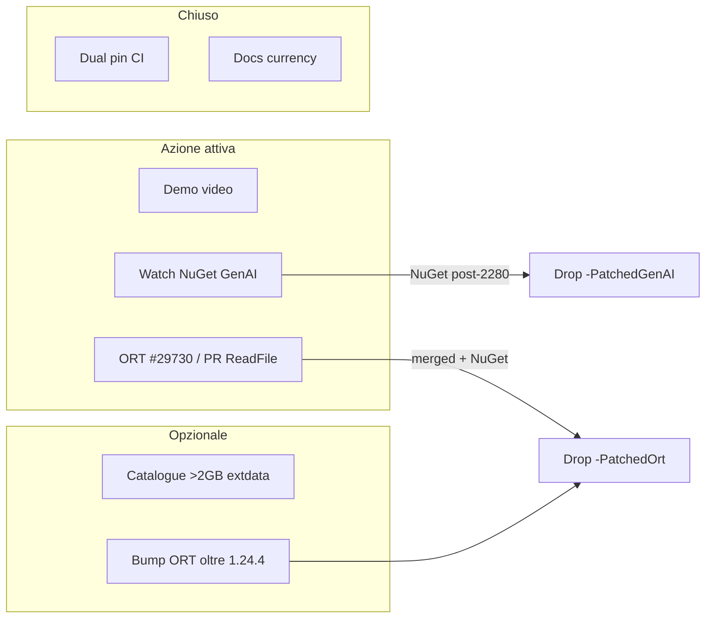

# Piano di risoluzione — vendor lifecycle e backlog residuo

**Data:** 2026-07-16  
**Stato dopo currency pass:** dual pin shipping (GenAI + ORT); docs allineati;
issue SSOT aperte. Questo piano chiude i restanti punti **operativi** (non
riscrittura di scienza già closed-negative).

---

## 0. Cosa è già chiuso

| Item                                      | Evidenza                                                                                     |
| ----------------------------------------- | -------------------------------------------------------------------------------------------- |
| PatchedOrt in shipping MSIX               | 1.1.8.0 + `vendor-dlls-v1` + `SHA256SUMS`                                                    |
| PatchedGenAI hash-pin (no rebuild per PR) | `build-uwp.yml` + GenAI `SHA256SUMS`                                                         |
| #2280 upstream merged                     | microsoft/onnxruntime-genai#2280 (2026-07-13, commit `ff53d6b9` on main — gap is NuGet-only) |
| weakly_canonical su ORT `main`            | microsoft/onnxruntime#28509 (non in NuGet 1.24.4)                                            |
| Docs drift D1–D8                          | currency pass in `project-analysis-2026-07.md`                                               |
| Issue tracker SSOT                        | xllama #84, #85, #86; ORT #29730                                                             |

---

## 1. Tracci e owner

| ID     | Obiettivo                          | Issue                                                    | Priorità          | Effort | Dipendenze                                                                                                                                                                                                                                                         |
| ------ | ---------------------------------- | -------------------------------------------------------- | ----------------- | ------ | ------------------------------------------------------------------------------------------------------------------------------------------------------------------------------------------------------------------------------------------------------------------ |
| **R1** | Demo video (clip 60–90 s)          | ROADMAP Phase 6                                          | **P1** content    | S–M    | Field smoke 1.1.8 PASS; **solo capture umano**                                                                                                                                                                                                                     |
| **R2** | Drop `-PatchedGenAI`               | [#84](https://github.com/gianlucamazza/xllama/issues/84) | **blocked** NuGet | S      | Poll: `scripts/check-vendor-nuget-status.sh` (latest still 0.14.1)                                                                                                                                                                                                 |
| **R3** | Upstream ReadFile 16 MB            | [#86](https://github.com/gianlucamazza/xllama/issues/86) | **PR open**       | M      | [ORT #29732](https://github.com/microsoft/onnxruntime/pull/29732) + [#29730](https://github.com/microsoft/onnxruntime/issues/29730)                                                                                                                                |
| **R4** | Drop `-PatchedOrt`                 | [#85](https://github.com/gianlucamazza/xllama/issues/85) | **blocked** NuGet | S      | Attende merge #29732 + NuGet con #28509                                                                                                                                                                                                                            |
| **R5** | Catalogue entry >2 GB int4 extdata | ROADMAP optional                                         | **deferred**      | M      | HF flaky; Meta license — non mirrorare su models-v1; USB/LocalState già valida PatchedOrt                                                                                                                                                                          |
| **R6** | Vendor pin refresh ops             | #85                                                      | **done tooling**  | S      | Dual pin + `check-vendor-nuget-status.sh` + fail-closed GenAI install                                                                                                                                                                                              |
| **R7** | DML graph-capture opt-out upstream | [#91](https://github.com/gianlucamazza/xllama/issues/91) | **PR open**       | S      | [GenAI #2300](https://github.com/microsoft/onnxruntime-genai/pull/2300) (opt-out + KV clamp, on-device proven); tooling prerequisite for re-enabling DML text once the driver fault ([ORT #29739](https://github.com/microsoft/onnxruntime/issues/29739)) is fixed |

---

## 2. Sequenza consigliata

### Fase A — Product close (questa settimana / prossima)

1. **Demo video (R1)**
   - Deploy [v1.1.8.0](https://github.com/gianlucamazza/xllama/releases/tag/v1.1.8.0) o ultimo `xllama-appx`.
   - Checklist ROADMAP: first-launch LFM → chat short/long → Image Generate → capture.
   - Chiudere bullet ROADMAP + nota in Discussion #76 se utile.

### Fase B — Watch & drop GenAI (event-driven)

2. **Monitor NuGet GenAI (R2)**
   - Trigger: nuova versione `Microsoft.ML.OnnxRuntimeGenAI.DirectML` con #2280  
     (verificare `CreateDmlObjects` / `agility_device_created` nel tree del tag).
   - Eseguire checklist issue #84 (bump packages.config → rimuovere pin CI → smoke XAML+DML).
   - Chiudere #84; aggiornare #85.

### Fase C — ORT path (parallelo, non bloccante)

3. **PR ORT #29732 (R3) — APERTA 2026-07-16**
   - https://github.com/microsoft/onnxruntime/pull/29732
   - Prossimo: review MS → merge → attendere NuGet → drop PatchedOrt (#85).
   - Se rifiutano: tenere pin; rivalutare solo al bump ORT.
   - **Non** reimplementare weakly_canonical (già #28509 su main).

4. **Drop PatchedOrt (R4)** solo dopo NuGet che include:
   - path AppContainer (#28509 o equivalente), **e**
   - chunk ReadFile (nostra o loro).
   - Checklist simmetrica a #84; chiudere #85 quando entrambi i pin sono spariti.

### Fase D — Opzionale product surface

5. **Catalogue >2 GB extdata int4 (R5)**
   - Solo se si vuole rendere PatchedOrt **visibile** in picker senza USB.
   - Asset + `manifest.json` + smoke download/load.
   - Non prioritario se non c’è un modello “vetrina”.

### Fase E — Manutenzione pin (continua)

6. **Refresh pin (R6)**
   - GenAI: `gh workflow run build-uwp-patched.yml` → re-validate → upload `vendor-dlls-v1` → bump `SHA256SUMS`.
   - ORT: `build-uwp-ort-patched.yml` (1–3 h) → stesso flusso.
   - **Mai** cambiare hash senza console re-validate.

---

## 3. Criteri di “done” per i pin

| Pin   | Done quando                                                                                          | Verifica console                |
| ----- | ---------------------------------------------------------------------------------------------------- | ------------------------------- |
| GenAI | NuGet stock passa XAML + DML `OgaCreateModel` senza `887A0036`                                       | Routing GPU load + short decode |
| ORT   | NuGet stock carica model con `.onnx.data` >~1.5 GB senza weakly_canonical crash e senza errcode 1450 | 2–3 restart load+generate       |

---

## 4. Cosa **non** riaprire

Già closed-negative con evidenza — non investire:

- DML int4 decode competitivo (§12)
- ≥1B fp16 GPU inference (budget wall §7)
- AppContainer mmap per GGUF load (#57→#58)
- USB spike per bypass weakly_canonical (refutato)

---

## 5. Checklist operativa immediata

- [x] Push currency/pin commit (`436ddd3`+)
- [ ] Verificare run `build-uwp` verde: “Download pinned patched runtime DLLs” per **entrambe** le DLL
- [x] PR ReadFile → [ORT #29732](https://github.com/microsoft/onnxruntime/pull/29732)
- [x] `scripts/check-vendor-nuget-status.sh` + fail-closed GenAI install
- [ ] Demo video capture (R1 — umano)
- [ ] Poll: `./scripts/check-vendor-nuget-status.sh` + review ORT #29732

---

## 6. Riferimenti

- ROADMAP Phase 6 open bullets
- `vendor/onnxruntime-genai-patched/`, `vendor/onnxruntime-patched/`
- `patches/README.md`
- `docs/uwp-constraints.md` §7–§8
- Issues: [#84](https://github.com/gianlucamazza/xllama/issues/84), [#85](https://github.com/gianlucamazza/xllama/issues/85), [#86](https://github.com/gianlucamazza/xllama/issues/86)
- Upstream: [GenAI #2280](https://github.com/microsoft/onnxruntime-genai/pull/2280), [ORT #28509](https://github.com/microsoft/onnxruntime/pull/28509), [ORT #29730](https://github.com/microsoft/onnxruntime/issues/29730)
