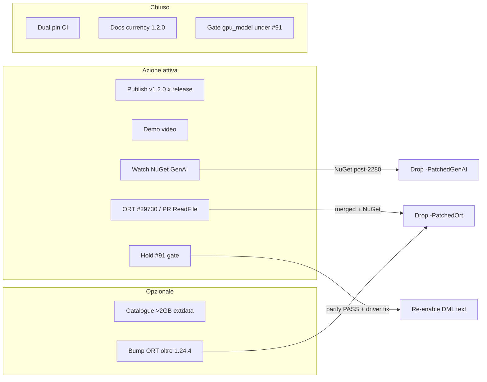

# Piano di risoluzione — vendor lifecycle e backlog residuo

**Data:** 2026-07-17 (currency su 1.2.0 + #91)  
**Stato:** dual pin shipping (GenAI + ORT); docs allineati
([`project-analysis-2026-07.md`](project-analysis-2026-07.md) currency
2026-07-17); issue SSOT aperte. Questo piano chiude i restanti punti
**operativi** (non riscrittura di scienza già closed-negative).

---

## 0. Cosa è già chiuso

| Item | Evidenza |
| --- | --- |
| PatchedOrt in shipping MSIX | 1.1.8.0+ + `vendor-dlls-v1` + `SHA256SUMS` |
| PatchedGenAI hash-pin (no rebuild per PR) | `build-uwp.yml` + GenAI `SHA256SUMS` |
| #2280 upstream merged | microsoft/onnxruntime-genai#2280 (gap is NuGet-only) |
| weakly_canonical su ORT `main` | microsoft/onnxruntime#28509 (non in NuGet 1.24.4) |
| Docs drift D1–D13 | currency pass 2026-07-17 in `project-analysis-2026-07.md` |
| DML text routing gated (#91) | `kDmlTextLogitsBroken`; #95/#98/#100 no gpu_model auto-provision |
| Console FULL PASS 1.2.0.x | `1.2.0.534` (2026-07-16): routing gate, GGUF, TAESD, LAN API |
| Issue tracker SSOT | xllama #84, #85, #86, #91; ORT #29730 / #29739 |

---

## 1. Tracci e owner

| ID | Obiettivo | Issue | Priorità | Effort | Dipendenze |
| --- | --- | --- | --- | --- | --- |
| **R0** | Publish GitHub Release **v1.2.0.x** | ops (Latest still v1.1.8.0) | **P1** ops | S | CI `xllama-appx` + cert + VCLibs |
| **R1** | Demo video (clip 60–90 s) | ROADMAP Phase 6 | **P1** content | S–M | Deploy 1.2.0 CI artifact or post-R0 release; **solo capture umano** |
| **R2** | Drop `-PatchedGenAI` | [#84](https://github.com/gianlucamazza/xllama/issues/84) | **blocked** NuGet | S | Poll: `scripts/check-vendor-nuget-status.sh` |
| **R3** | Upstream ReadFile 16 MB | [#86](https://github.com/gianlucamazza/xllama/issues/86) | **PR open** | M | [ORT #29732](https://github.com/microsoft/onnxruntime/pull/29732) |
| **R4** | Drop `-PatchedOrt` | [#85](https://github.com/gianlucamazza/xllama/issues/85) | **blocked** NuGet | S | Merge #29732 + NuGet con #28509 |
| **R5** | Catalogue entry >2 GB int4 extdata | ROADMAP optional | **deferred** | M | License; USB/LocalState already validates PatchedOrt |
| **R6** | Vendor pin refresh ops | #85 | **done tooling** | S | Dual pin + poll script + fail-closed GenAI |
| **R7** | DML graph-capture opt-out upstream | tooling for #91 | **PR open** | S | [GenAI #2300](https://github.com/microsoft/onnxruntime-genai/pull/2300); driver track [ORT #29739](https://github.com/microsoft/onnxruntime/issues/29739) |
| **R8** | Hold DML text gate until parity PASS | [#91](https://github.com/gianlucamazza/xllama/issues/91) | **P0** process | — | `kDmlTextLogitsBroken`; re-enable only via `validate-logit-parity.sh` |

---

## 2. Sequenza consigliata

### Fase A — Product / release close

1. **Publish v1.2.0.x (R0)** — so GitHub Latest matches semantic head on `main`
   (LAN API, `llama32-3b`, #91/#95/#100). Until then use CI `xllama-appx`.
2. **Demo video (R1)**
   - Deploy latest `xllama-appx` (prefer post-R0 tag) or CI artifact.
   - Checklist ROADMAP: first-launch LFM → chat short/long → Image Generate → capture.
   - Note: long-prompt routing stays on **CPU** while #91 holds (still demo-valid).

### Fase B — Watch & drop GenAI (event-driven)

3. **Monitor NuGet GenAI (R2)**
   - Trigger: `Microsoft.ML.OnnxRuntimeGenAI.DirectML` with #2280.
   - Checklist issue #84 → drop pin → smoke XAML + DML *device create* (not text logits).

### Fase C — ORT path (parallelo)

4. **PR ORT #29732 (R3)** → merge → NuGet → **Drop PatchedOrt (R4)**.
5. **Non** reimplementare weakly_canonical (già #28509 su main).

### Fase D — DML text (blocked on driver)

6. **Hold gate (R8)** until on-device parity PASS.
7. GenAI #2300 (R7) is tooling only — does **not** alone re-enable text.

### Fase E — Opzionale / pin refresh

8. Catalogue >2 GB extdata (R5) — deferred.
9. Pin refresh (R6) — never change hash without console re-validate.

---

## 3. Criteri di “done” per i pin

| Pin | Done quando | Verifica console |
| --- | --- | --- |
| GenAI | NuGet stock passa XAML + DML `OgaCreateModel` senza `887A0036` | Model load (text routing still gated by #91) |
| ORT | NuGet stock carica `.onnx.data` grande senza weakly_canonical crash e senza errcode 1450 | 2–3 restart load+generate |
| DML text (#91) | `validate-logit-parity.sh` PASS on DML text model | Then flip `kDmlTextLogitsBroken` + re-enable provision |

---

## 4. Cosa **non** riaprire

Già closed-negative con evidenza — non investire:

- DML int4 decode competitivo (§12)
- ≥1B fp16 GPU inference (budget wall §7)
- AppContainer mmap per GGUF load
- USB spike per bypass weakly_canonical
- Phi-3.5-mini catalogue (measured slower + heavier than Llama-3.2-3B)
- Re-enable DML text “to try” without parity harness

---

## 5. Checklist operativa immediata

- [x] Dual pin shipping + docs currency (1.1.8 → analysis 2026-07-17)
- [x] PR ReadFile → [ORT #29732](https://github.com/microsoft/onnxruntime/pull/29732)
- [x] `scripts/check-vendor-nuget-status.sh` + fail-closed GenAI install
- [x] #91 gate + #95/#100 gpu_model skip (console verified 1.2.0.534)
- [x] Project analysis currency pass 1.2.0 / #91
- [ ] **Publish GitHub Release v1.2.0.x** (R0 — Latest still v1.1.8.0)
- [ ] Demo video capture (R1 — umano)
- [ ] Poll: `./scripts/check-vendor-nuget-status.sh` + review ORT #29732 / GenAI #2300

---

## 6. Riferimenti

- ROADMAP Phase 6–7 open bullets
- `docs/project-analysis-2026-07.md` (currency 2026-07-17)
- `vendor/onnxruntime-genai-patched/`, `vendor/onnxruntime-patched/`
- `patches/README.md`
- `docs/uwp-constraints.md` §7–§8
- Issues: [#84](https://github.com/gianlucamazza/xllama/issues/84), [#85](https://github.com/gianlucamazza/xllama/issues/85), [#86](https://github.com/gianlucamazza/xllama/issues/86), [#91](https://github.com/gianlucamazza/xllama/issues/91)
- Upstream: [GenAI #2280](https://github.com/microsoft/onnxruntime-genai/pull/2280), [GenAI #2300](https://github.com/microsoft/onnxruntime-genai/pull/2300), [ORT #28509](https://github.com/microsoft/onnxruntime/pull/28509), [ORT #29730](https://github.com/microsoft/onnxruntime/issues/29730), [ORT #29739](https://github.com/microsoft/onnxruntime/issues/29739)
